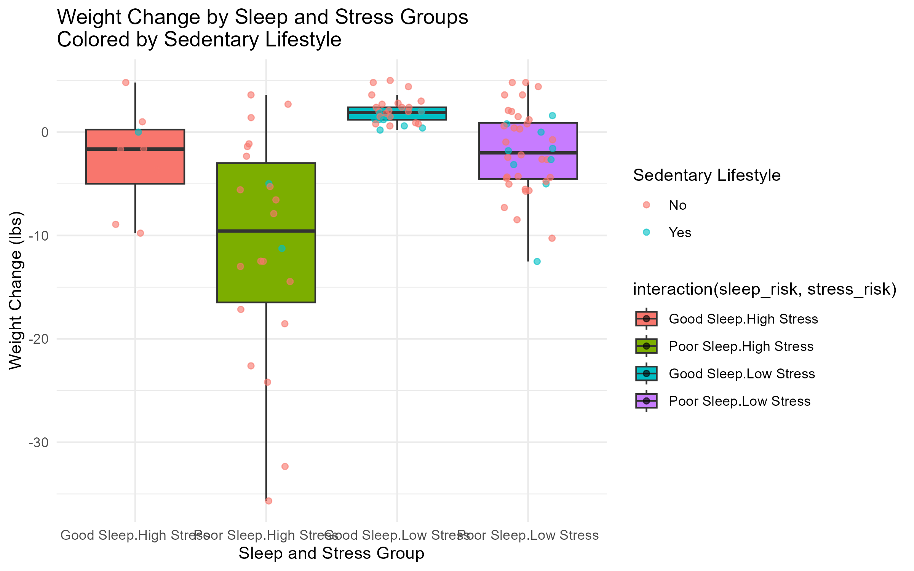

```{r setup, include=FALSE}
knitr::opts_chunk$set(echo = FALSE)
if (!require("pacman")) install.packages("pacman")
pacman::p_load(tidyverse, broom, kableExtra, ggplot2,flextable)

# Install phantomjs if needed
#webshot2::install_phantomjs()

# Set path to results
results_dir <- "Results"

# Load pivot tables
sleep_pivot <- read_csv(file.path(results_dir, "Sleep_Risk_Pivot.csv"))
stress_pivot <- read_csv(file.path(results_dir, "Stress_Risk_Pivot.csv"))

# Load regression summaries
sleep_model_text <- readLines(file.path(results_dir, "Sleep_Stress_Model.txt"))
stress_model_text <- readLines(file.path(results_dir, "Stress_Age_Model.txt"))
```


Introduction
```{r}
cat("Analysis of key determinants of health care based on WHO-funded data\nFocus on sleep, stress, physical activity, and demographic differences\nGoal: Provide practical insights for improving health outcomes")
```

Sleep as a Proxy for Health
```{r}

cat("How does high stress impact the benefits of adequate sleep?\nAnalysis using boxplots and regression models with interaction effects\nTo what extent can stress diminish or negate sleep's positive health effects?")

```


Visualising Sleep-Stress Interaction 
```{r}
# Load and display your boxplot

```

Sleep Risk by Age Group 
```{r}
flextable(sleep_pivot) 
```


Stress Risk by Age 
```{r}
flextable(stress_pivot) 
```

Regression Results : Sleep-Stress Interaction 
```{r}
sleep_model_text <- readLines("Results/Sleep_Stress_Model.txt")
cat(sleep_model_text, sep = "\n")
```

Regression Results : Stress-Age Interaction
```{r}

stress_model_text <- readLines("Results/Stress_Age_Model.txt")
cat(stress_model_text, sep = "\n")

```

Key Findings 
- High stress significantly reduces the health benefits of good sleep
- Physical activity moderates the sleep-health relationship
- Early career adults (30-39) show greatest vulnerability to stress
- Middle-aged adults experience strongest negative interactions

Notes
```{r}
cat("In this presentation, I will highlight how sleep serves as a proxy for overall health, emphasizing the complex role that high stress plays in potentially reducing the positive effects of good sleep. We will also explore how physical activity modifies this relationship, examining whether inactivity can cancel out the benefits of quality sleep. Finally, I will discuss which demographic groups—particularly younger versus older adults—are most impacted by poor sleep, stress, and inactivity, providing actionable insights for targeted health interventions.")
```


